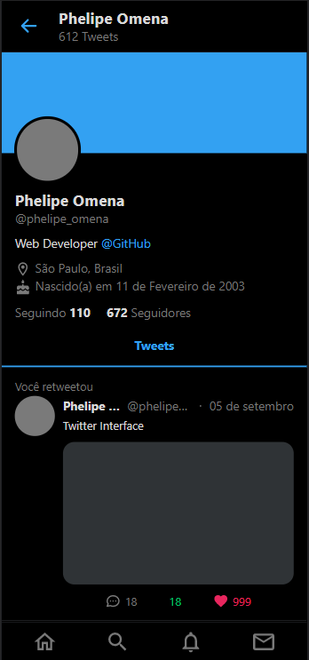
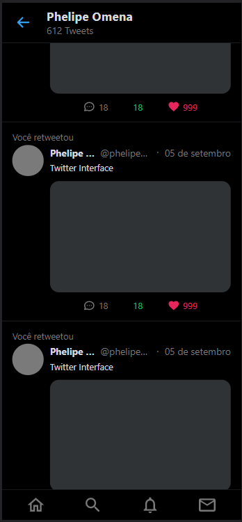
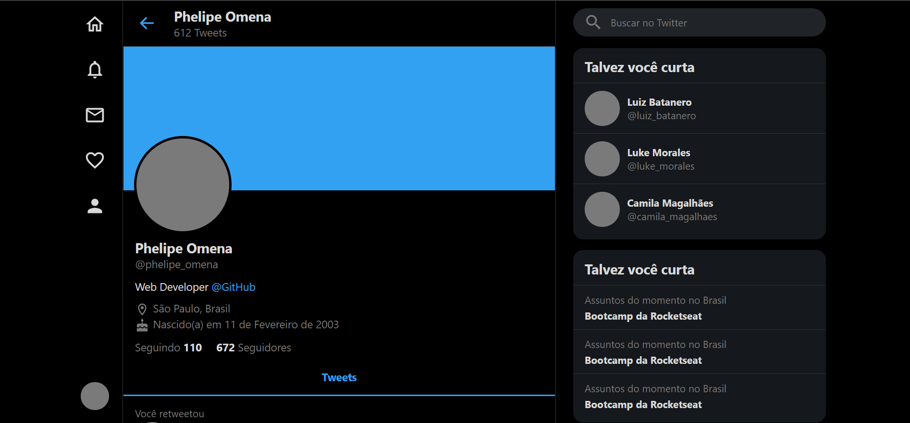
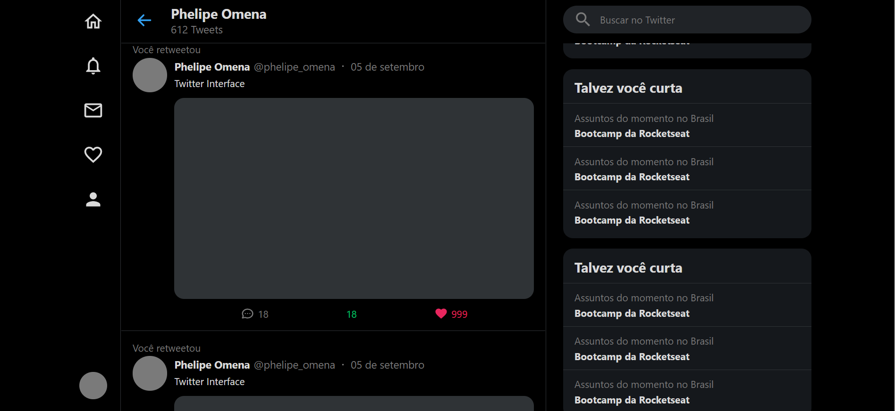

<h1 align="center">UI Clone - Twitter</h1>
<h1 align="center"></h1>
  
<h3 align="center">Aplicação Desenvolvida com a <a href="https://www.youtube.com/channel/UCSfwM5u0Kce6Cce8_S72olg">@Rocketseat</a> no UI Clones. Esse é um projeto totalmente responsivo, baseado na interface do <a href="https://twitter.com/?lang=en">@Twitter</a>.</h2>
  
---  
  
### 👨‍💻 Technologias Utilizadas
<p display="block" align="left">
  <a href="https://reactjs.org/">React JS</a>&nbsp;&nbsp;&nbsp;|&nbsp;&nbsp;
  <a href="https://www.typescriptlang.org/docs/">TypeScript</a>
</p>
  
## Para rodar a aplicação

> OBS: Deve-se utilizar o gerenciador de pacotes npm ou o yarn para rodar os comandos abaixo

Execute ```npm install``` no terminal da sua IDE.

Rode ```npm start``` e acesse via **localhost:3000**.

---

### 📱 Mobile
<p align="center">
  
  
</p>

---
  
### 💻 Desktop
<p align="center">
  
  
</p>

---  
  
#### 🔗 Visualização completa:
https://twitter-chi.vercel.app/

<h4 align="center"> <em>&lt;/&gt;</em> by <a href="https://github.com/PhOmena" target="_blank">PhOmena</a> </h4>


